# QUBIKA
## Technical Test
### Exercise 1: QA Analyst
#### Charter 1: Exploratory Testing

**Objective**: is the system is in optimal condition and ready for use by the client?

**Conclusion**: The system is not in optimal conditions to be used by the client. There are several bugs and some show stoppers like Bug number 8.

I strongly suggest to fix all the bugs found and described below, before send the system to the client.

--- 

Below you will find my notes while doing exploratory testing. A note could be belong to any of these categories:

1. Bug
1. Inquiry to the development team
1. Request for enhancement
1. Design question
1. Needs more information

### System Conditions

Bug pre-conditions are:

- Browser: Will be indicated per bug 
- Device: will be indicated per bug
- OS: macOS Sonoma 14.1.2

### API calls

**Question for Developers**: Why did you use POST action for deletion instead of DELETE action?

#### Login Page

**Question for designer**: Text written by the user has the same color as inactive placeholders. is that the expected design? or written text should have a strong color?

---

**Bug 1**: A red line appears for specific browser widths:
- Severity: low
- Steps to reproduce: 
	- Browser: Safari and Chrome
	- Device: Desktop (desktop views above 768px)
	1. Go to the [login page](https://club-administration.qa.qubika.com/#/auth/login)
	1. Resize window size incrementing the width slowly and you'll notice a red line appearing and disappearing.
- Evidence: 
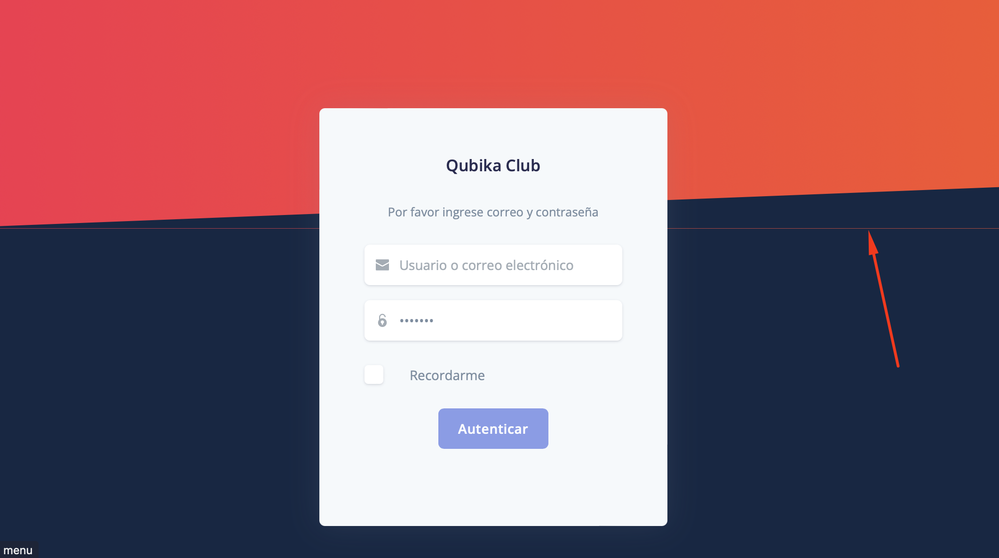
- Expected: Design keeps consistent while increasing or decreasing width

---
 
**Bug 2**: Mobile nav is empty once opened from the hamburger button.

- Severity: low
- Note: it seems plausible that there are no nav options in this view, so why not remove the hamburger?
- Steps to reproduce: 
	- Browser: Safari and Chrome
	- Device: Mobile (mobile views below 768px)
	1. Go to the [login page](https://club-administration.qa.qubika.com/#/auth/login)
	1. Tap on the hamburger button to open the nav.
	1. Bug: empty navigation menu (? needs confirmation with the dev team)
- Evidence: 
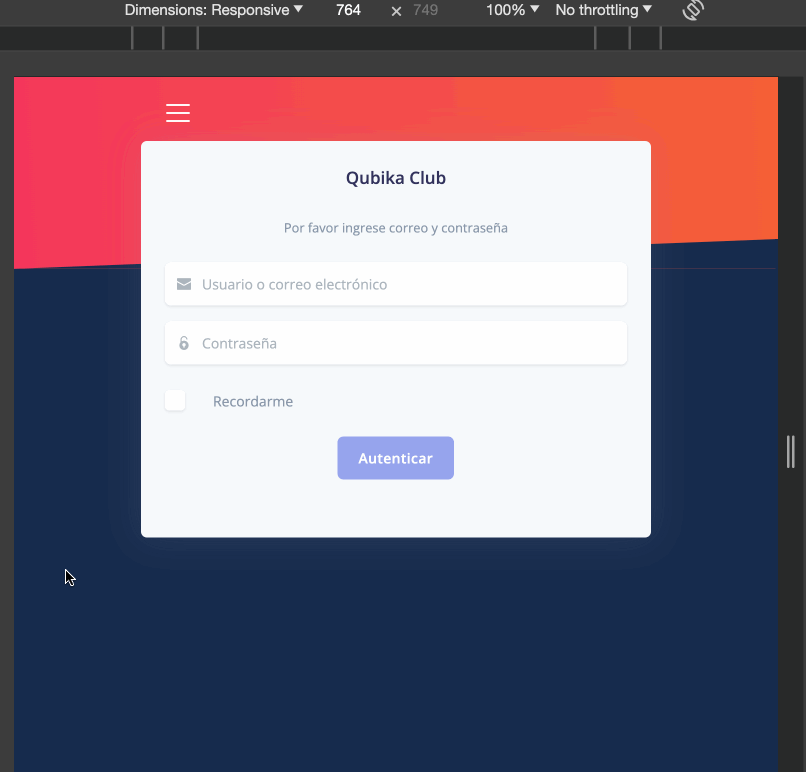
- Expected: Design keeps consistent while increasing or decreasing width

---

**Question for designer**: The error message shown, when credentials are wrong, should match the rest of the design?
- Evidence: 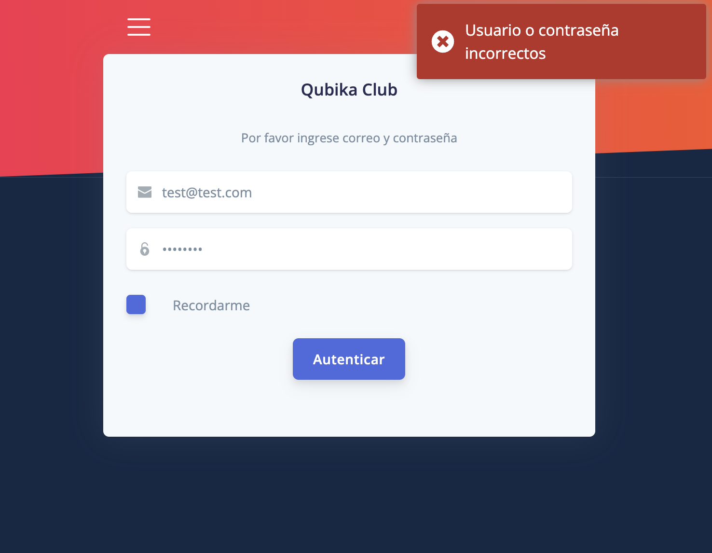

---

**Bug 3**: Login error message is log out in the console log. 

- Severity: low
- Steps to reproduce: 
	- Browser: Safari and Chrome
	- Device: Either mobile or desktop
	1. Open the browser dev tools and go to the Console tab
	1. Go to the [login page](https://club-administration.qa.qubika.com/#/auth/login)
	1. Fill in the login form with incorrect information: test@test.com / pass: any
	1. Click/tap on 'Autenticar' button
	1. Bug: Console log throws code error.
	1. Bug 2: Status text response: "ok"
- Evidence: 
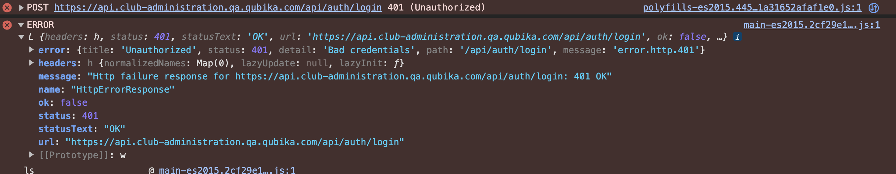
- Expected 1: No console logs should be in shown in production environment.
- Expected 2: Status text should said: 'Unauthorized'

---

### Dashboard view

**Bug 4**: Bars plot overflows in the parent space, breaking the design:
- Severity: medium
- Steps to reproduce:
	- Browser: Safari and Chrome
	- Device: Desktop and Mobile
	1. Go to the [dashboard page](https://club-administration.qa.qubika.com/#/dashboard)
	1. Bug: 'Total Contributions' plot overflows available space.
- Evidence: 
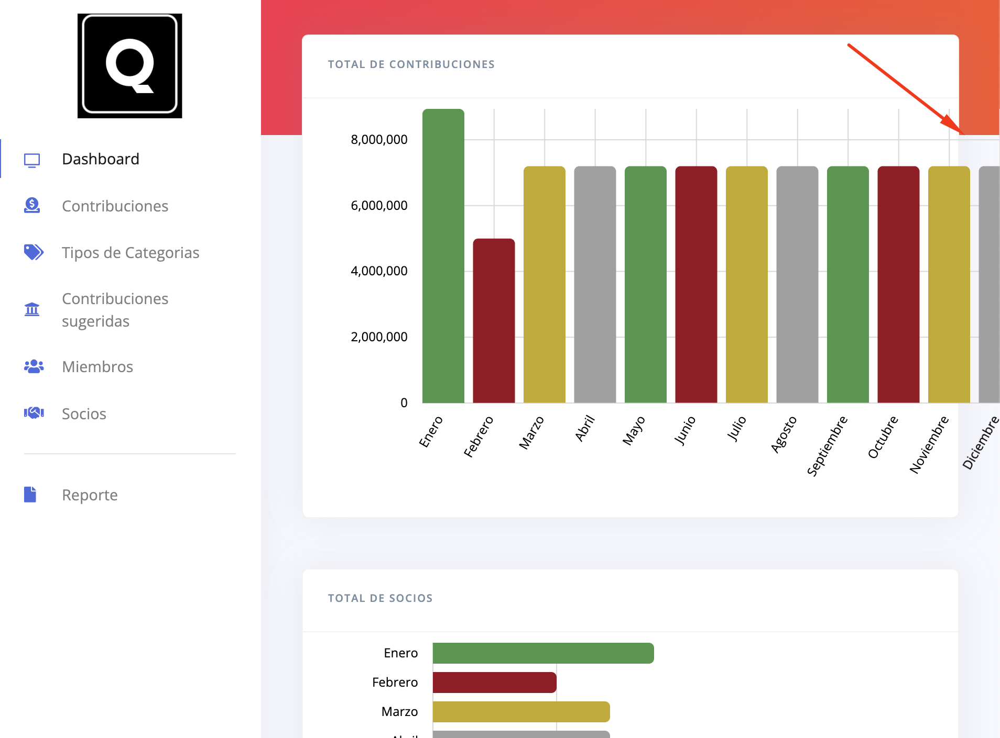
- Expected: bars plot should fit in the parent space. (Validate with the design team)

---

**Bug 5**: Total n of partners uses the same data set as total of contributions
- Severity: high
- Steps to reproduce:
	- Browser: Safari and Chrome
	- Device: Desktop and Mobile
	1. Go to the [dashboard page](https://club-administration.qa.qubika.com/#/dashboard)
	1. Bug: 'Total Partners' shows same data as 'Total Contributions'.
- Evidence: 
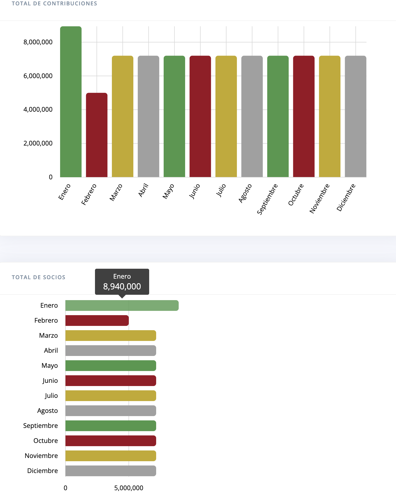
- Expected: Total partners should match use the correct data.

--- 

**Bug 6**: Profile and Alerts nav options are only visible in mobile view:
- Severity: high
- Steps to reproduce:
	- Browser: Safari and Chrome
	- Device: Desktop (above 768 px width)
	1. Go to the [dashboard page](https://club-administration.qa.qubika.com/#/dashboard)
	1. Resize the browser width to below 768px.
	1. Bug: on Desktop view the nav options alerts and profile are not rendered
- Evidence: 
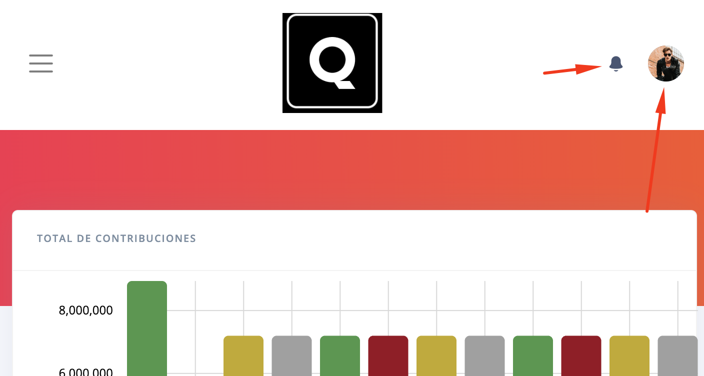
- Expected: Both nav options should be part of the nav menu in desktop view.

--- 

### Profile view

**Bug 7**: Profile avatar doesn't match with nav button on mobile view:
- Severity: high
- Steps to reproduce:
	- Browser: Safari and Chrome
	- Device: Mobile (below 768 px width)
	1. Go to the [user profile page](https://club-administration.qa.qubika.com/#/user-profile)
	1. Bug: Profile avatar image in the nav doesn't match the avatar in the profile view.
- Evidence: 
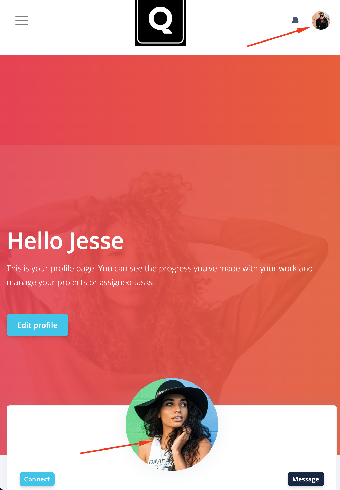
- Expected: Both avatar profiles should be the same.

--- 

**Bug 8**: Wrong profile information displayed on the user profile page:
- Severity: high
- Steps to reproduce:
	- Browser: Safari and Chrome
	- Device: Desktop and Mobile
	1. Go to the [user profile page](https://club-administration.qa.qubika.com/#/user-profile)
	1. Open Dev Tools and go to the Network tab and look for the 'account' request.
	1. Bug: Profile information doesn't match the account information used to login. 
- Evidence: 
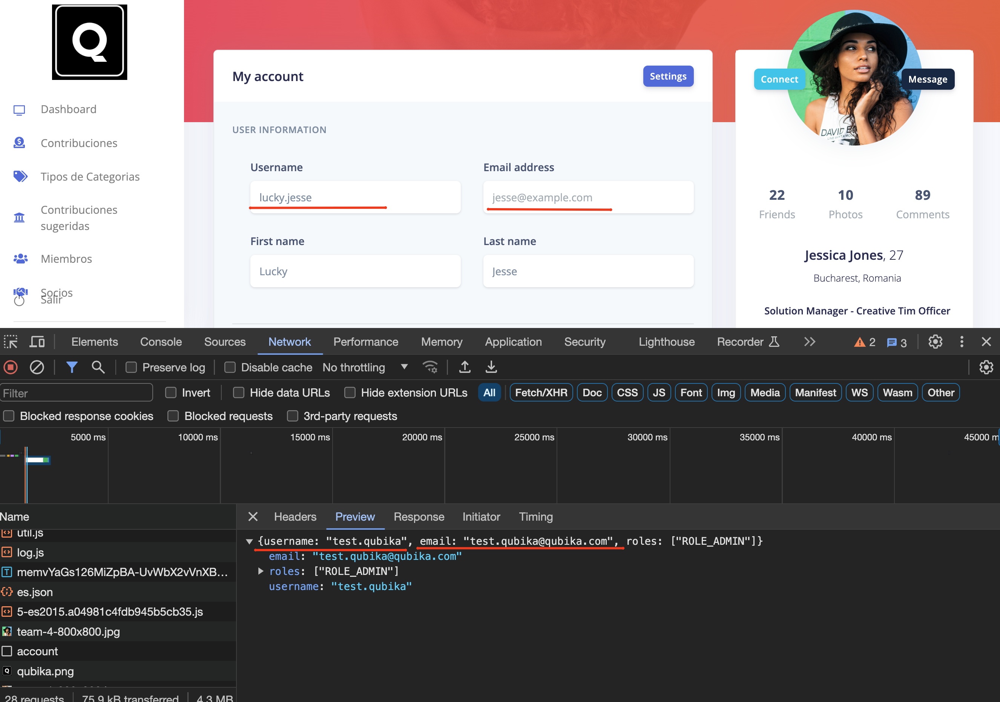
- Expected: User profile information should be the same as the user used to login into the system.

--- 

**Bug 9**: Edit profile button redirects the user to the dashboard view:
- Severity: high
- Steps to reproduce:
	- Browser: Safari and Chrome
	- Device: Desktop and Mobile
	1. Go to the [user profile page](https://club-administration.qa.qubika.com/#/user-profile)
	1. Click/tap on 'Edit profile' button
	1. Bug: redirects the user to the dashboard view 
- Evidence: 
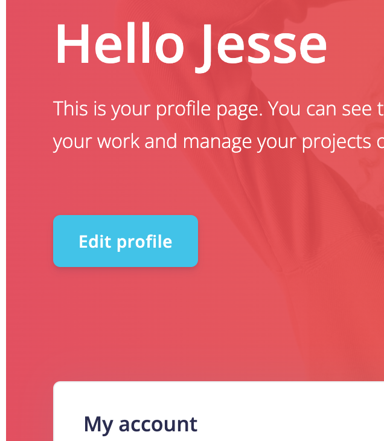
- Expected: The user should be redirected to Edit profile view.

### Category types view

**Bug 10**: Pagination buttons overflow the parent space:
- Severity: medium
- Steps to reproduce:
	- Browser: Safari and Chrome
	- Device: Desktop and Mobile
	1. Go to the [category types](https://club-administration.qa.qubika.com/#/category-type)
	1. Add at least 50 categories using the API
	1. Bug: pagination buttons overflow the available parent space. (Check designs) 
- Evidence: 
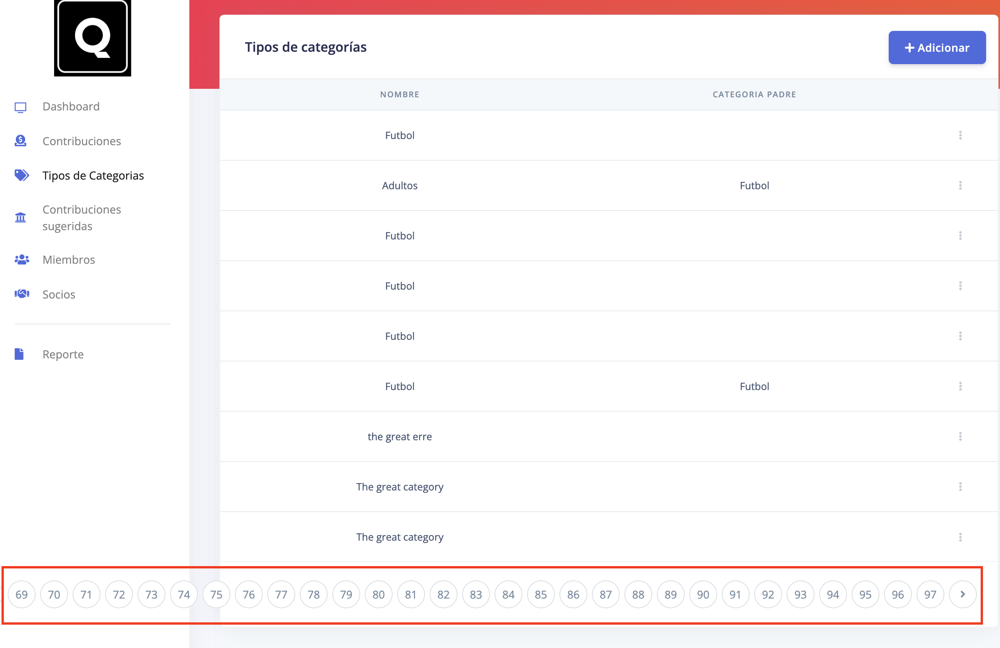
- Expected: Check designs.

### Contribution Suggested

**Bug 10**: Validate data format before POST action:
- Severity: medium
- Steps to reproduce:
	- Browser: Safari and Chrome
	- Device: Desktop and Mobile
	1. Go to the [contribution suggested](https://club-administration.qa.qubika.com/#/contribution-suggested)
	1. Click on 'Adicionar'
	1. Select any category
	1. Select any payment method
	1. Put a string of characters in Amount to pay.
	1. Open the dev tools and go to the network tab
	1. Click on Accept
	1. Bug: Check the network error: the frontend isn't validating data type and sending what ever you put on the Amount to pay field.
- Evidence: 
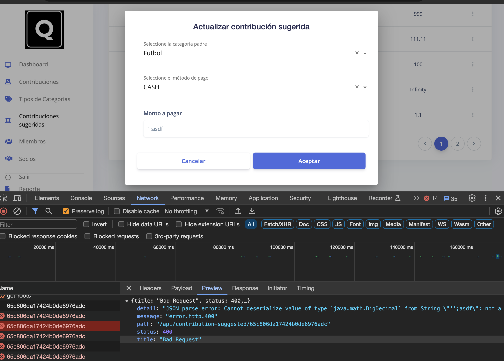
- Expected: Frontend validates data before sending it to the backend and prevents the submit action if there is incorrect data. 

